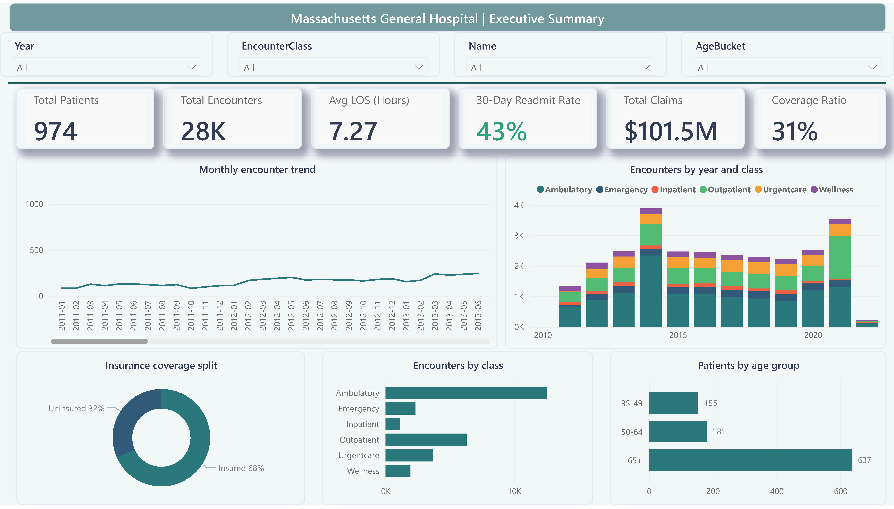
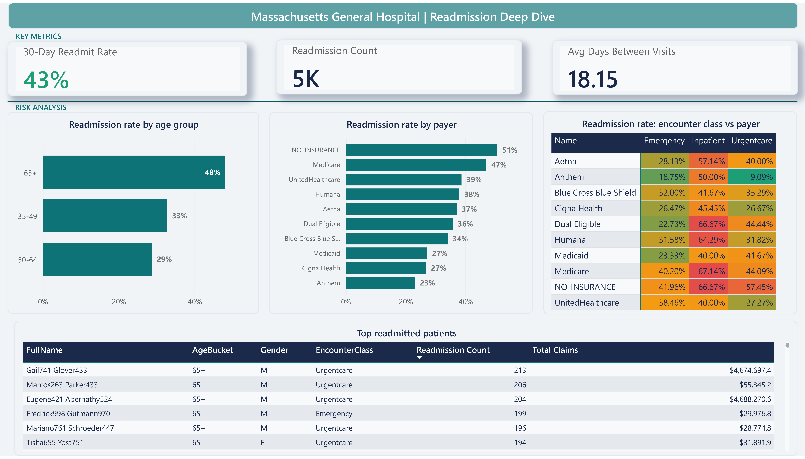
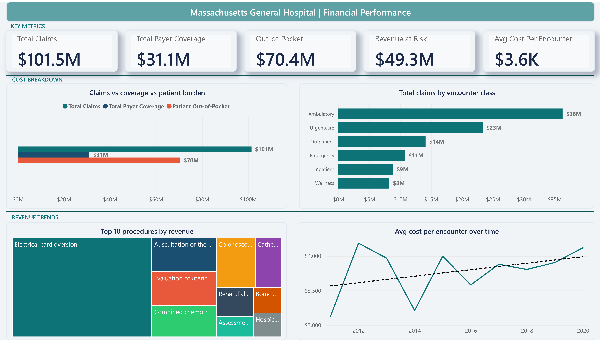
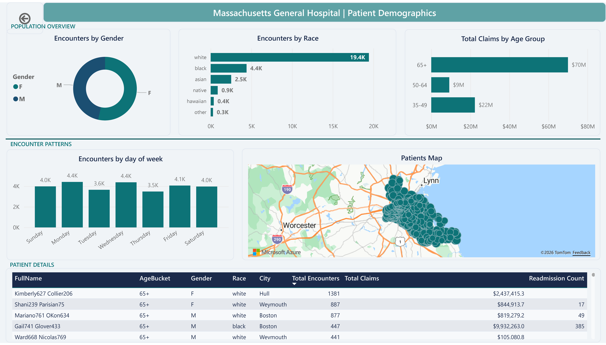

# Hospital Readmission & Patient Analytics Dashboard

An end-to-end healthcare analytics solution analyzing patient encounters, 30-day readmissions, financial performance, and demographics at Massachusetts General Hospital (MGH). Built with Azure SQL Database, advanced DAX, and a 4-page interactive Power BI dashboard.

---

## Business Problem

Hospitals face significant financial penalties under the CMS Hospital Readmissions Reduction Program (HRRP) when 30-day readmission rates exceed national benchmarks. MGH's executive team needed visibility into readmission patterns, cost drivers, and patient risk factors to make data-driven decisions about resource allocation and post-discharge care programs.

This project answers five critical questions:
- How many patients are being readmitted within 30 days, and what is the trend?
- Which patient demographics (age, insurance type) carry the highest readmission risk?
- What is the financial impact of uninsured and readmitted patients?
- How has the average cost per encounter changed over time?
- Where are the highest-risk patient populations geographically concentrated?

---

## Dashboard Preview

### Page 1: Executive Summary

High-level KPIs with monthly encounter trends, insurance coverage split, and encounter class distribution. Interactive year range slider filters all visuals simultaneously.

### Page 2: Readmission Deep Dive

30-day readmission analysis segmented by age group and payer. Heatmap matrix reveals which encounter class and payer combinations carry the highest readmission risk. Drill-through enabled on the patient table.

### Page 3: Financial Performance

Claims vs. payer coverage vs. patient out-of-pocket breakdown. Cost trend analysis showing rising average cost per encounter over time. Top 10 revenue-generating procedures via treemap.

### Page 4: Patient Demographics & Drill-Through

Population overview by gender, race, and age group. Geographic map of patient locations. Day-of-week encounter patterns. Full patient detail table with drill-through from Page 2.

---

## Key Insights

- **43% of clinical patients are readmitted within 30 days**, far exceeding the national benchmark. The 65+ age group has the highest rate at 48%.
- **Uninsured patients (NO_INSURANCE) have the highest readmission rate at 51%**, suggesting a lack of post-discharge follow-up care for this population.
- **$49.3M in revenue is at risk** from uninsured encounters, representing nearly half of total claims.
- **Average cost per encounter has risen from ~$3,000 in 2011 to ~$4,200 in 2022**, a 40% increase over the decade.
- **65+ patients account for $70M in total claims** (69% of all costs) despite being only 38% of the patient population, indicating disproportionate resource consumption.
- **Inpatient encounters have the highest readmission rate at 57%** across all payer types, pointing to potential gaps in discharge planning.

---

hospital-readmission-analytics/
|
|-- README.md
|
|-- /Raw Data
|   |-- patients.csv
|   |-- encounters.csv
|   |-- procedures.csv
|   |-- payers.csv
|   |-- organizations.csv
|
|-- /Scripts
|   |-- 00_EXECUTION_ORDER.sql
|   |-- 01_DimPayer.sql
|   |-- 02_DimEncounterClass.sql
|   |-- 03_DimPatient.sql
|   |-- 04_DimDate.sql
|   |-- 05_FactEncounters.sql
|   |-- 06_FactProcedures.sql
|
|-- /Hospital Data
|   |-- Hospital_Readmission_Dashboard.pbix
|
|-- /dashboard_screenshots
|   |-- Hospital Data_Page_1.png
|   |-- Hospital Data_Page_2.png
|   |-- Hospital Data_Page_3.png
|   |-- Hospital Data_Page_4.png

---

## Tech Stack & Skills Demonstrated

| Category | Techniques |
|----------|-----------|
| **SQL** | Window functions (LEAD, DENSE_RANK), recursive CTEs for date generation, views, multi-table JOINs, CASE statements, DATEDIFF, COALESCE, INFORMATION_SCHEMA queries |
| **DAX** | CALCULATE, CALCULATETABLE, ALLEXCEPT, SAMEPERIODLASTYEAR, DATESYTD, DATESINPERIOD, DIVIDE, SWITCH, SELECTEDVALUE, VAR syntax, conditional formatting measures |
| **ETL / Power Query** | DateTime parsing, column splitting and renaming, data type enforcement, null handling, M code date table generation, conditional columns |
| **Data Modeling** | Star schema design (2 fact tables, 4 dimension tables), relationship cardinality, single-direction cross-filtering, date table best practices |
| **Visualization** | 4-page dashboard with drill-through, conditional formatting (heatmap, data bars, color rules), bookmarks, KPI cards, treemap, map visual, waterfall-style chart, page navigation |
| **Cloud** | Azure SQL Database (free tier), firewall configuration, SSMS connection, Power BI cloud data source integration |
| **Business Acumen** | Healthcare KPIs (readmission rate, LOS, mortality), CMS penalty context, payer mix analysis, revenue-at-risk quantification, actionable insight narration |

---

## Data Source

**Dataset:** Maven Analytics Data Playground - Hospital Patient Records
**URL:** [mavenanalytics.io/data-playground/hospital-patient-records](https://mavenanalytics.io/data-playground/hospital-patient-records)
**Scope:** Synthetic data on ~1,000 patients from Massachusetts General Hospital (2011-2022)
**Volume:** 75,592 records across 55 fields in 5 source tables

---

## Data Model

Raw CSV data was loaded into **Azure SQL Database** and transformed into a star schema:

**Fact Tables:**
- `FactEncounters` (~27,891 rows) - Central fact table with LengthOfStay and 30-day readmission flag calculated via LEAD() window function
- `FactProcedures` (~47,702 rows) - Procedures linked to encounters with duration calculations

**Dimension Tables:**
- `DimPatient` (~974 rows) - Demographics with calculated Age, AgeBucket, IsDeceased
- `DimDate` (4,383 rows) - Full calendar spine generated via recursive CTE, supports all DAX time intelligence
- `DimPayer` (10 rows) - Insurance providers with derived InsuranceStatus column
- `DimEncounterClass` (6 rows) - Encounter types with clinical sort order

---

## Future Enhancements

- Integrate real-time data via Azure Data Factory pipeline for automated refresh
- Add predictive readmission risk scoring using Python/R visuals in Power BI
- Implement Row-Level Security (RLS) for department-specific access
- Build a Power Automate alert when readmission rate exceeds threshold
- Expand to multi-hospital comparison if additional facility data becomes available

---

## License

This project is for educational and portfolio purposes. Dataset provided by [Maven Analytics](https://mavenanalytics.io/) under their open data playground.

---

## Connect

If you have questions about this project or want to discuss healthcare analytics, feel free to reach out.
